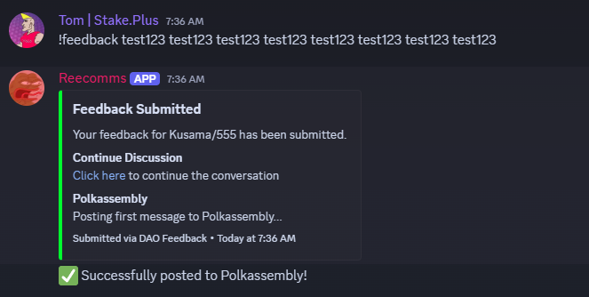
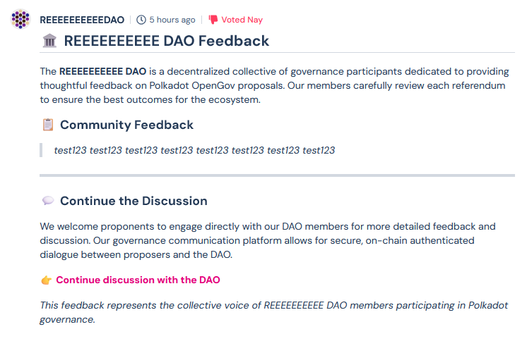
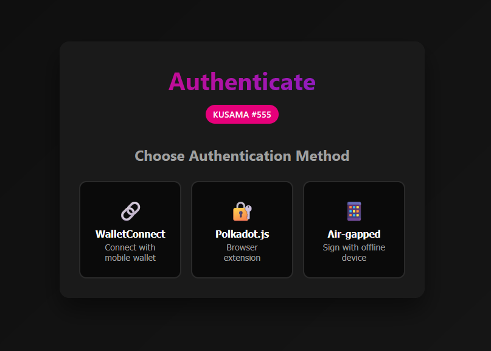
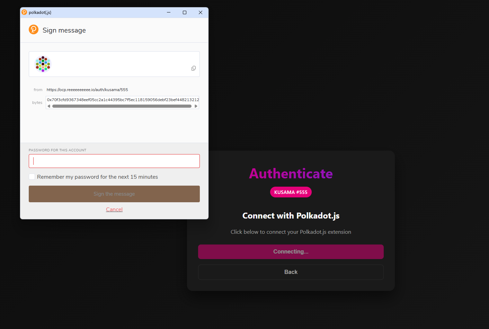
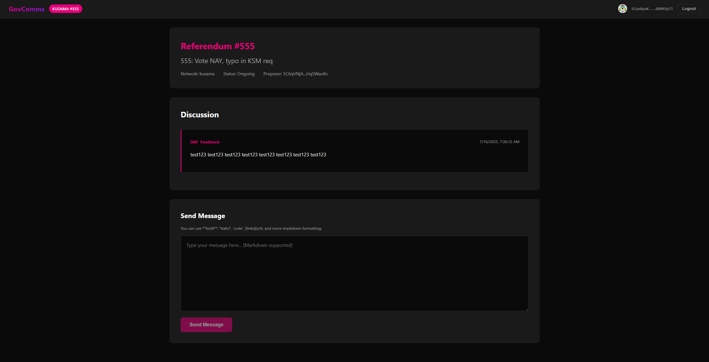
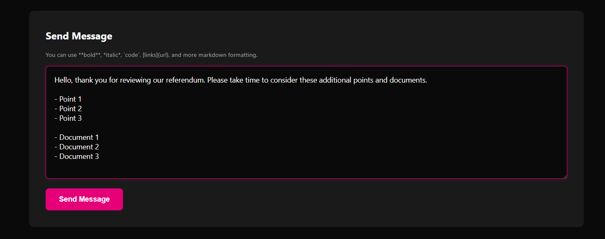
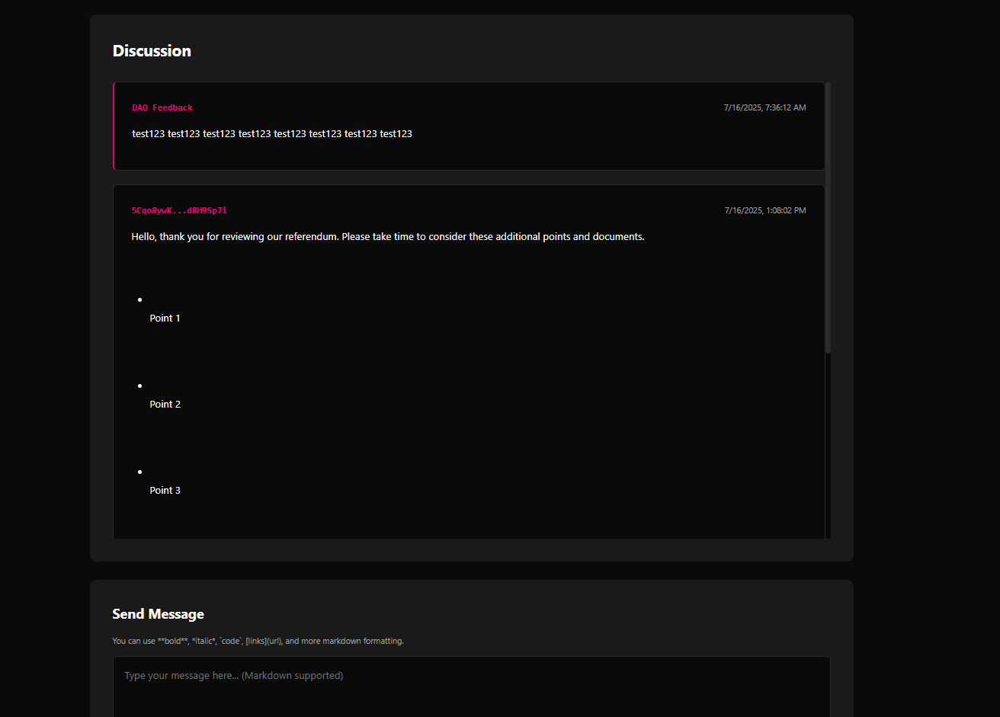
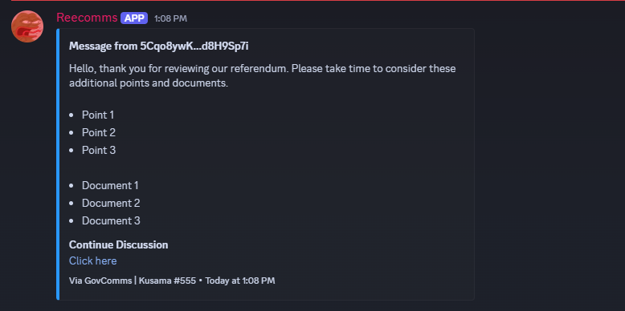

# GovComms - Polkadot Governance Communication Platform

## Overview

GovComms is a decentralized communication platform designed to bridge the gap between proposal creators and DAO members in the Polkadot ecosystem. It enables secure, authenticated dialogue between referendum proponents and governance participants, facilitating transparent discussions while maintaining organized communication channels within Discord.

## Purpose

The platform addresses a critical need in blockchain governance: enabling structured communication between proposal creators and voting entities. When DAO members review referenda in their Discord channels, they often have questions, concerns, or require clarifications. GovComms provides a secure channel for this dialogue by authenticating participants through their wallet signatures and organizing conversations by referendum.

## Who Should Use GovComms

- **DAOs using Chaos DAO Discord Bot**: Organizations that want to integrate proponent communications directly into their governance discussion channels
- **Small Teams**: Groups participating in Polkadot/Kusama governance who need organized communication with proposers
- **Governance Groups**: Any collective that discusses and votes on referenda and wants direct access to proponents
- **Referendum Proponents**: Those who have submitted proposals and want to engage with voting entities

## Why Use GovComms

1. **Wallet-Authenticated Communication**: All participants verify their identity through wallet signatures
2. **Integrated Discussions**: Messages appear directly in the Discord threads where governance discussions happen
3. **Organized by Referendum**: Each conversation is tied to a specific referendum, preventing confusion
4. **Polkassembly Integration**: First feedback is automatically posted to Polkassembly for public visibility
5. **Multi-Network Support**: Works with both Polkadot and Kusama networks

## How It Works

### Step 1: DAO Issues Feedback

DAO members use the `!feedback` command in referendum discussion threads to submit their questions or concerns:

### Step 2: Feedback Posted to Polkassembly

The first feedback message is automatically posted to Polkassembly with a link back to the GovComms platform:

### Step 3: Proponent Authentication

When proponents click the link, they're directed to authenticate using their wallet:

They can choose from multiple authentication methods. Here's an example using Polkadot.js extension:

### Step 4: View and Respond to Messages

Once authenticated, proponents see all feedback messages for their referendum:

### Step 5: Compose Response

Proponents can write responses with full markdown support:

### Step 6: Message Sent Confirmation

After sending, the message appears in the conversation thread:

### Step 7: Response in Discord

The response is automatically posted to the appropriate Discord thread where DAO members can see it:

## System Architecture

GovComms consists of four main components:

1. **[GCApi](./GCApi.md)**: RESTful API server handling authentication, message storage, and business logic
2. **[GCBot](./GCBot.md)**: Discord bot managing feedback commands and message relay
3. **[GCUI](./GCUI.md)**: React-based web frontend for proponent interaction
4. **polkadot-go**: Helper library for Polkadot blockchain interactions

## Requirements

### System Requirements
- Linux server (Ubuntu 20.04+ or similar)
- MySQL 8.0+
- Redis 6.0+
- Go 1.23+
- Node.js 18+
- nginx or Apache (for frontend hosting)
- SSL certificates (required for production)

### Network Requirements
- Access to Polkadot/Kusama RPC endpoints
- Discord bot token and permissions
- Polkassembly API credentials (optional)

## Installation Overview

### 1. Database Setup

Create database and user:

    mysql -u root -p -e "CREATE DATABASE govcomms;"
    mysql -u root -p -e "CREATE USER 'govcomms'@'localhost' IDENTIFIED BY 'your_secure_password';"
    mysql -u root -p -e "GRANT ALL PRIVILEGES ON govcomms.* TO 'govcomms'@'localhost';"
    mysql -u root -p -e "FLUSH PRIVILEGES;"

Import the database schema:

    mysql -u govcomms -p govcomms < db/database.sql

### 2. Redis Setup

    sudo apt install redis-server
    sudo systemctl enable redis-server
    sudo systemctl start redis-server

### 3. Environment Configuration

Create environment files for each component:

**API Environment (.env.api)**:

    MYSQL_DSN=govcomms:password@tcp(127.0.0.1:3306)/govcomms
    REDIS_URL=redis://127.0.0.1:6379/0
    JWT_SECRET=your-secret-key
    PORT=443
    SSL_CERT=/path/to/cert.pem
    SSL_KEY=/path/to/key.pem
    POLL_INTERVAL=60

**Bot Environment (.env.bot)**:

    MYSQL_DSN=govcomms:password@tcp(127.0.0.1:3306)/govcomms
    REDIS_URL=redis://127.0.0.1:6379/0
    DISCORD_TOKEN=your-discord-bot-token
    FEEDBACK_ROLE_ID=your-feedback-role-id
    GUILD_ID=your-guild-id
    POLKASSEMBLY_SEED="your twelve word mnemonic seed phrase here"

### 4. Building Components

    # Build API
    cd src/GCApi
    go build -o ../../bin/gcapi

    # Build Bot
    cd ../GCBot
    go build -o ../../bin/gcbot

    # Build Frontend
    cd ../GCUI
    npm install
    npm run build

### 5. Systemd Service Setup

Copy the systemd service files:

    sudo cp docs/systemd/*.service /etc/systemd/system/
    sudo systemctl daemon-reload
    sudo systemctl enable gcapi gcbot
    sudo systemctl start gcapi gcbot

## Web Server Configuration

### nginx Configuration

Create /etc/nginx/sites-available/govcomms:

    server {
        listen 80;
        server_name your-domain.com;
        return 301 https://$server_name$request_uri;
    }

    server {
        listen 443 ssl http2;
        server_name your-domain.com;

        ssl_certificate /path/to/cert.pem;
        ssl_certificate_key /path/to/key.pem;
        ssl_protocols TLSv1.2 TLSv1.3;
        ssl_ciphers HIGH:!aNULL:!MD5;

        # Frontend
        location / {
            root /var/www/govcomms;
            try_files $uri /index.html;
            
            # Security headers
            add_header X-Frame-Options "DENY";
            add_header X-Content-Type-Options "nosniff";
            add_header X-XSS-Protection "1; mode=block";
            add_header Strict-Transport-Security "max-age=31536000";
        }

        # API proxy
        location /v1/ {
            proxy_pass https://localhost:443;
            proxy_set_header Host $host;
            proxy_set_header X-Real-IP $remote_addr;
            proxy_set_header X-Forwarded-For $proxy_add_x_forwarded_for;
            proxy_set_header X-Forwarded-Proto $scheme;
        }
    }

Enable the site:

    sudo ln -s /etc/nginx/sites-available/govcomms /etc/nginx/sites-enabled/
    sudo nginx -t
    sudo systemctl reload nginx

### Apache Configuration

Create /etc/apache2/sites-available/govcomms.conf:

    <VirtualHost *:80>
        ServerName your-domain.com
        Redirect permanent / https://your-domain.com/
    </VirtualHost>

    <VirtualHost *:443>
        ServerName your-domain.com
        DocumentRoot /var/www/govcomms

        SSLEngine on
        SSLCertificateFile /path/to/cert.pem
        SSLCertificateKeyFile /path/to/key.pem

        # Security headers
        Header always set X-Frame-Options "DENY"
        Header always set X-Content-Type-Options "nosniff"
        Header always set X-XSS-Protection "1; mode=block"
        Header always set Strict-Transport-Security "max-age=31536000"

        # Frontend
        <Directory /var/www/govcomms>
            Options -Indexes +FollowSymLinks
            AllowOverride All
            Require all granted
            
            # React router support
            RewriteEngine On
            RewriteBase /
            RewriteRule ^index\.html$ - [L]
            RewriteCond %{REQUEST_FILENAME} !-f
            RewriteCond %{REQUEST_FILENAME} !-d
            RewriteRule . /index.html [L]
        </Directory>

        # API proxy
        ProxyPass /v1/ https://localhost:443/v1/
        ProxyPassReverse /v1/ https://localhost:443/v1/
        ProxyPreserveHost On
    </VirtualHost>

Enable required modules and site:

    sudo a2enmod ssl proxy proxy_http headers rewrite
    sudo a2ensite govcomms
    sudo apache2ctl configtest
    sudo systemctl reload apache2

## Security Considerations

1. **SSL/TLS**: Always use HTTPS in production
2. **Firewall**: Configure firewall to only allow necessary ports
3. **Database**: Use strong passwords and restrict access
4. **JWT Secret**: Generate a strong, random JWT secret
5. **Discord Token**: Keep bot token secure and never commit to git
6. **Regular Updates**: Keep all components and dependencies updated

## Monitoring

Monitor service status:

    sudo systemctl status gcapi gcbot

View logs:

    sudo journalctl -u gcapi -f
    sudo journalctl -u gcbot -f

## Troubleshooting

1. **API won't start**: Check SSL certificates and port permissions
2. **Bot disconnects**: Verify Discord token and network connectivity
3. **Database errors**: Ensure MySQL is running and credentials are correct
4. **Frontend 404**: Check nginx/Apache configuration for proper routing
5. **Authentication fails**: Verify RPC endpoints are accessible

## Support

For issues and questions:
- Check component-specific documentation
- Review service logs
- Ensure all dependencies are properly installed
- Verify network connectivity to RPC endpoints

## License

This project is licensed under the MIT License.